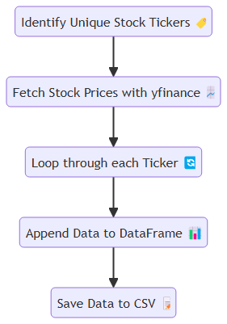
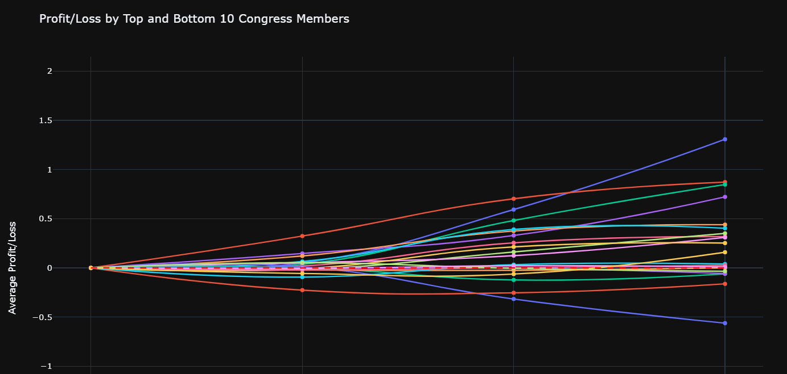
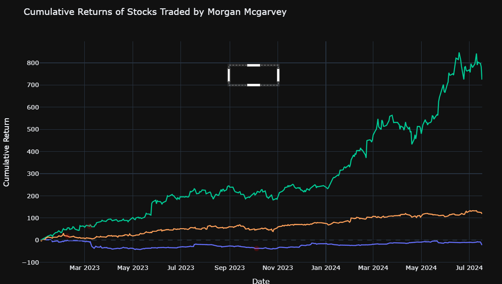
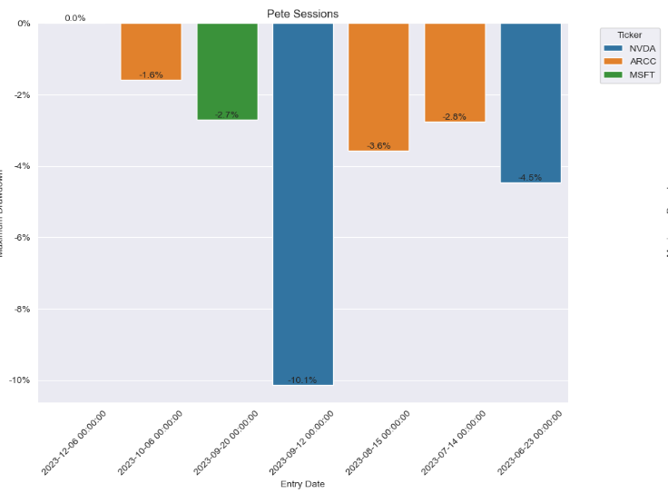

# Congressional Stock Trading Analysis 2023

## Project Overview

This project analyzes the stock trading activities of members of the United States Congress for the year 2023. It aims to provide insights into trading patterns, performance across different time horizons, and variations among political parties and individual members.

## Key Components

1. **Data Preparation and Cleaning**
   - Imported congressional trading data for 2023 from an Excel file
   - Filtered data to focus on stock purchases
   - Added columns for short-term, mid-term, and long-term trade dates
   - Collected stock price data using yfinance and integrated it with the dataset

2. **Profit/Loss Calculation**
   - Calculated profit/loss for short-term, mid-term, and long-term holdings
   - Added these calculations to the dataframe

3. **Statistical Analysis**
   - Performed basic statistical analysis to compare short-term, mid-term, and long-term trading performance
   - Created visualizations (box plots) to show the distribution of returns by term

4. **Party and Chamber Analysis**
   - Analyzed trading performance by political party (Democrat vs Republican)
   - Analyzed performance by chamber (House vs Senate)
   - Created bar charts to visualize these comparisons

5. **Individual Congressman Analysis**
   - Identified top-performing and bottom-performing members of Congress based on trading performance
   - Created a line plot showing the profit/loss progression for these members over different terms

6. **Detailed Analysis of Top Performers**
   - Selected four top-performing congressmen for more detailed analysis
   - For each of these congressmen:
     - Plotted the cumulative returns of stocks they traded
     - Marked their entry points on these plots
     - Calculated and visualized the maximum drawdown for each of their trades

7. **Maximum Drawdown Analysis**
   - Created a function to calculate the maximum drawdown for each trade
   - Visualized these maximum drawdowns in a 2x2 grid of bar plots, one for each top-performing congressman

## Key Findings

1. Long-term holdings generally performed better than short-term or mid-term holdings.
2. There were some differences in performance between parties and chambers, but these differences weren't substantial enough to beat benchmark standards.
3. Individual congressmen showed significant variations in their trading performance.
4. The maximum drawdown analysis revealed the risk levels associated with different trades made by top-performing congressmen.

## Conclusion

This analysis provides insights into the trading patterns and performance of members of Congress in 2023. It highlights the importance of holding period, shows some differences between political affiliations, and identifies particularly successful (and unsuccessful) traders among the congressmen.

## Future Work

Potential areas for future analysis include:
- Expanding the dataset to cover multiple years
- Incorporating more economic indicators and market trends
- Analyzing the relationship between trading activities and legislative actions
- Developing predictive models based on congressional trading patterns

# Regression Analysis of profits over Time

1. The notebook starts by loading and preprocessing a dataset of stock trades, categorized into different terms (short, mid, and long-term).
It performs various statistical analyses and visualizations, including:

Linear regression to model the relationship between trade duration and profits
Exponential regression to potentially improve the model fit
Monte Carlo simulations to estimate profit distributions for different trade terms
The analysis particularly focuses on long-term trades, supporting the hypothesis that they tend to have higher profitability and returns. Key findings for long-term trades include:

A mean profit of 0.18 (18%)
A median profit of 0.18 (18%)
A 95% confidence interval for profits ranging from -0.62 to 0.98
A 67.22% probability of positive profit
A 95% Value at Risk (VaR) of 0.48
The profit distribution appears to be normal (based on the Shapiro-Wilk test)
A standard deviation of profits of 0.40
Slightly positive skewness (0.0060) and kurtosis (0.0438)
A 95% Expected Shortfall of 0.66

The notebook includes visualizations such as histograms of simulated profits and various statistical measures to support the analysis.
Overall, the analysis in this notebook provides quantitative evidence supporting the observation that long-term trades tend to have higher profitability and returns compared to shorter-term trades in the context of the analyzed stock trading data.
This analysis complements and reinforces the findings from the company stock data, offering a more detailed statistical examination of the profitability patterns across different trading time horizons.

# Basic overview  file 
1. The notebook starts by importing necessary libraries like pandas and matplotlib.
It loads a dataset from an Excel file named 'congress-trading-all (3).xlsx' which contains information about stock trades.
The data is filtered to include only trades from 2023.

Several analyses are performed on this dataset:
a. A bar chart is created to show the number of transactions by state.
b. Another bar chart displays the number of transactions by chamber (House vs. Senate).
c. The code calculates and displays the top 10 best-performing stock tickers based on excess returns.

The analysis reveals some interesting insights:
a. There's a significant difference in the number of transactions between the House and Senate.
b. The top-performing stock (AFRM) had an average excess return of about 178%.
c. Well-known tech stocks like NVDA (NVIDIA) and COIN (Coinbase) are among the top performers.

The notebook uses various pandas operations for data manipulation and matplotlib for visualization.
Overall, this notebook provides a basic exploratory data analysis of congressional stock trading in 2023, focusing on geographical distribution of trades, differences between chambers, and identifying the most profitable stocks based on excess returns.

## Here is the diagram illustrating the Stock Data Extraction Process:

